# Claw Switch

**让每个人都能轻松驾驭 OpenClaw，同时统一管理 Claude Code、Qwen Code、OpenCode 等主流 AI 编程工具配置的桌面管理工具。**

---

## 一、项目做什么 & 优势

### 要解决的问题

OpenClaw 等 AI 编程工具能力很强，但 **onboarding 门槛高**：需要折腾 Node 环境、配置文件、daemon、渠道 Token、改错一个逗号就起不来。Claw Switch 用图形化把「安装 → 配置 → 诊断 → 修复」闭环做完，**从 0 到 1 几分钟上手**。

### 核心能力概览

| 方向 | 能力 |
|------|------|
| **OpenClaw 深度集成** | 多渠道消息网关（Telegram、飞书、钉钉等 8+）、Agent 配置、供应商热切换、实时诊断与自动修复、工作区编辑器（AGENTS.md、SOUL.md） |
| **Coding Plan 原生支持** | 阿里云百炼一键配置、国内/国际端点、多协议、内置 Qwen/GLM/MiniMax/Kimi 等模型，首购低至 7.9 元接入 |
| **五类工具统一管理** | Claude Code、Codex、Gemini CLI、OpenCode、OpenClaw 的供应商、MCP、Prompts、会话等在一处管理 |

### 主要优势

- **OpenClaw 一键安装 & 可视化配置**：无需手改 JSON，渠道、Agent、网关（LAN/认证/Tailscale）全部图形化。
- **诊断 + 自动修复**：一键 `openclaw doctor`，支持 `--repair --yes` 自动修复并重启，结果可复制成报告。
- **日志按模块/级别过滤**：按 Service/Channel/AI 等维度着色与过滤，便于快速定位问题。
- **50+ 预设供应商**：Coding Plan、百炼、DeepSeek、Kimi、GLM、OpenRouter 等，系统托盘可快速切换。
- **多 Agent 实例 & 备份**：创建/删除/重命名实例、一键打包备份，渠道 Token 在 UI 内即可轮换。
- **一份配置多端同步**：Coding Plan 等配置可同步到 Claude Code、OpenCode、OpenClaw，避免重复配置。


## 二、快速使用

### 下载安装

前往 [Releases](https://github.com/heimanba/claw-switch/releases) 页面下载最新版本，根据你的系统选择对应安装包：

- **macOS**：`Claw-Switch-v0.0.2-macOS.zip`（解压即用）或 `Claw-Switch-v0.0.2-macOS.tar.gz`（Homebrew）；若提示「无法验证开发者」，参见下方 [常见问题](#常见问题)。
- **Windows**：`Claw-Switch-v0.0.2-Windows.msi`（安装版）或 `Claw-Switch-v0.0.2-Windows-Portable.zip`（绿色版）。
- **Linux (x86_64)**：`Claw-Switch-v0.0.2-Linux-x86_64.AppImage` / `.deb` / `.rpm`，按发行版选择。
- **Linux (ARM64)**：`Claw-Switch-v0.0.2-Linux-arm64.AppImage` / `.deb` / `.rpm`，按发行版选择。

当前示例版本：[v0.0.2](https://github.com/heimanba/claw-switch/releases/tag/v0.0.2)。

### 基本使用

1. **添加供应商**：主界面 →「添加供应商」→ 选择预设（如 Coding Plan）→ 填入 API Key。
2. **切换供应商**：主界面选择供应商 →「启用」，或从系统托盘直接切换。
3. **配置 OpenClaw**：进入 OpenClaw 面板 → 配置渠道、Agent 默认值、网关绑定与认证。

### 数据与配置位置

- 数据库：`~/.claw-switch/claw-switch.db`（SQLite）
- 设置：`~/.claw-switch/settings.json`
- 备份：`~/.claw-switch/backups/`
- Skills：`~/.claw-switch/skills/`

---

## 三、架构与开发

### 架构概览

```
┌─────────────────────────────────────────────────────────────┐
│                    前端 (React + TypeScript)                 │
│  ┌─────────────┐  ┌──────────────┐  ┌──────────────────┐    │
│  │ Components  │  │    Hooks     │  │  TanStack Query  │    │
│  └─────────────┘  └──────────────┘  └──────────────────┘    │
└────────────────────────┬────────────────────────────────────┘
                         │ Tauri IPC (invoke)
┌────────────────────────▼────────────────────────────────────┐
│                  后端 (Tauri 2 + Rust)                        │
│  ┌─────────────┐  ┌──────────────┐  ┌──────────────────┐    │
│  │  Commands   │  │   Services   │  │  SQLite (DB)     │    │
│  └─────────────┘  └──────────────┘  └──────────────────┘    │
└─────────────────────────────────────────────────────────────┘
```

- **前端**：React 18、TypeScript、Vite、TailwindCSS、TanStack Query。通过 `@tauri-apps/api` 的 `invoke()` 调用后端 Tauri Command。
- **后端**：Rust 侧在 `src-tauri/src/commands/` 下按领域拆分（如 `provider.rs`、`openclaw.rs`、`proxy.rs`、`prompt.rs`），通过 `AppState` 持有 `Database` 与 `ProxyService`，业务逻辑在 `services/`，持久化在 `database/`（DAO + schema + migration）。
- **设计原则**：SSOT（单一事实源）、原子写入、与各工具配置双向同步、并发安全。

### 开发者注意事项

- **配置即真相**：供应商、MCP、Prompts 等以 SQLite 为主存储，同时要同步到各工具本地配置（如 Claude/Qwen/OpenCode 的 JSON/TOML），修改时注意「读 → 改 → 写」的原子性及与 live config 的一致性。
- **多工具多格式**：不同工具配置格式不同（JSON/TOML/YAML），对应解析与写入在 `src-tauri/src/` 下各 `*_config.rs`（如 `claude_mcp`、`qwen_config`、`opencode_config`、`openclaw_config`），改一处要检查是否影响其他工具。
- **OpenClaw 与代理**：OpenClaw 安装/诊断/日志等通过 commands 调用 CLI 或本地服务；代理相关逻辑在 `proxy/`，与前端通过 `commands/proxy.rs` 等暴露。
- **深链接**：`clawswitch://` 由 Tauri 插件处理，解析后通过事件通知前端，导入逻辑在 `deeplink/`。

### 本地开发

```bash
# 依赖
pnpm install

# 开发模式（前端 + Tauri 窗口）
pnpm dev

# 仅前端（若只改 UI）
pnpm dev:renderer

# 构建
pnpm build

# 类型检查与单测
pnpm typecheck
pnpm test:unit
```

**技术栈**：React 18 · TypeScript · Vite · TailwindCSS · TanStack Query · Tauri 2 · Rust · SQLite

提交前请确保通过 `pnpm typecheck` 和 `pnpm test:unit`。

---

## 界面预览

### Claude Code
| Claude Code 概览 | 模型配置 |
| :---------------------------------------: | :------------------------------------------: |
| 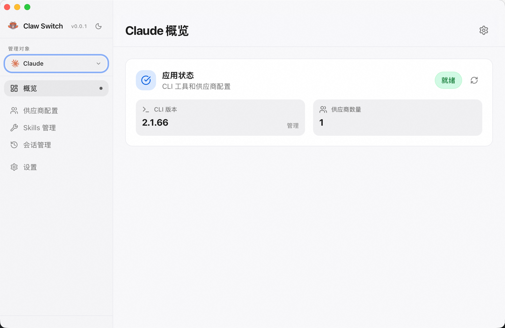 | 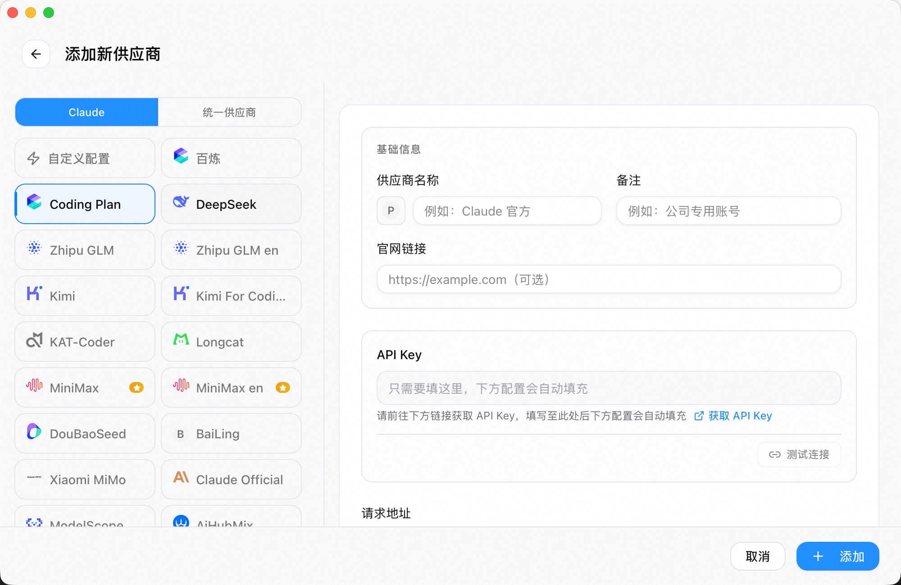 |

### Qwen Code
| Qwen Code 概览 | 模型配置 |
| :---------------------------------------: | :------------------------------------------: |
| 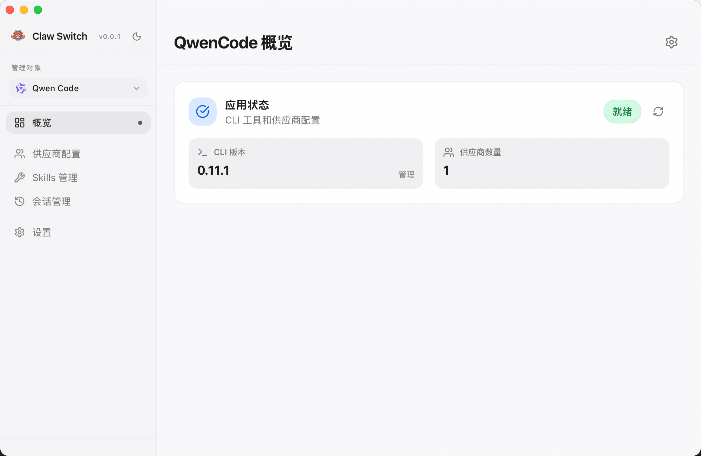 | 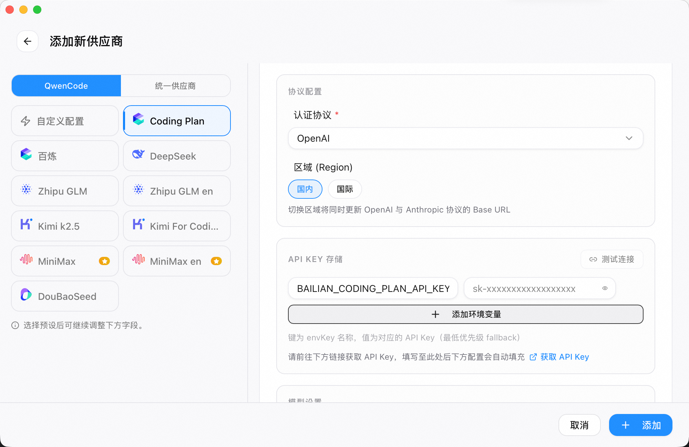 |

### OpenCode
| OpenCode 概览 | LLM 供应商 |
| :---------------------------------------: | :------------------------------------------: |
| 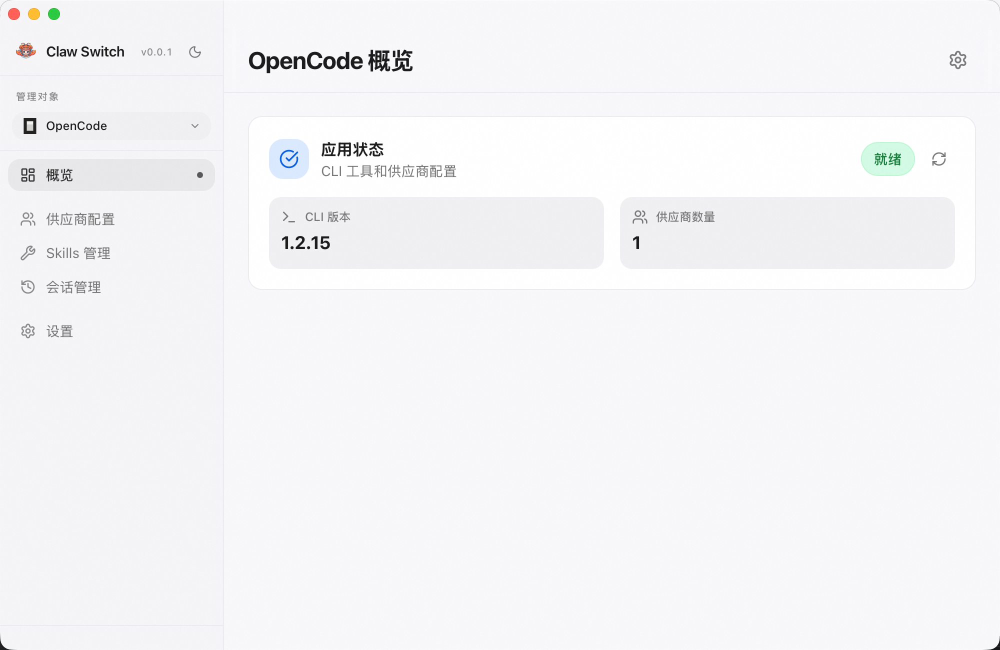 | 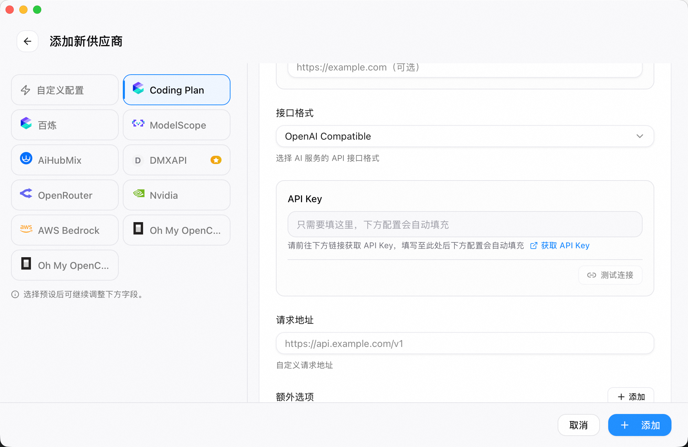 |

### OpenClaw
| OpenClaw 概览 | 聊天 |
| :---------------------------------------: | :------------------------------------------: |
| 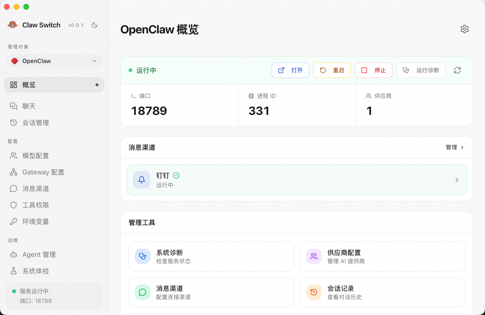 | 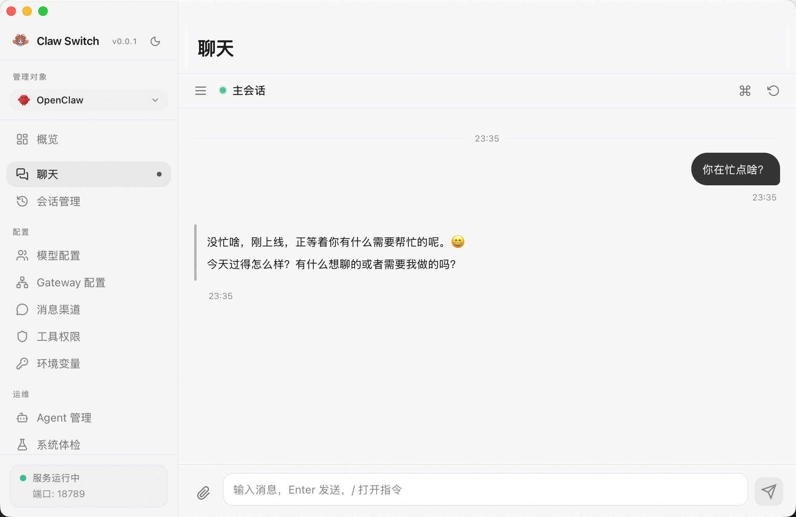 |

| 渠道配置 | Agent 配置 | 模型配置 |
| :---------------------------------------: | :------------------------------------------: | :------------------------------------------: |
| 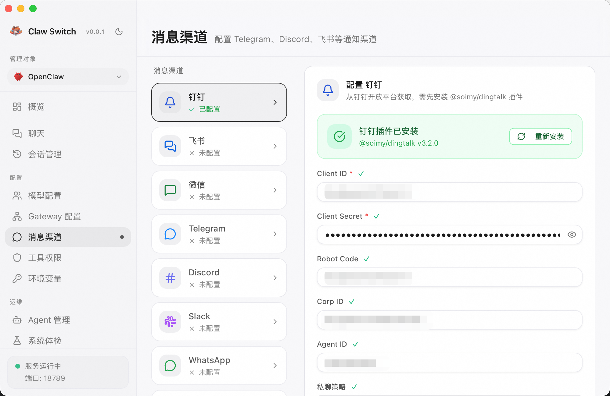 | 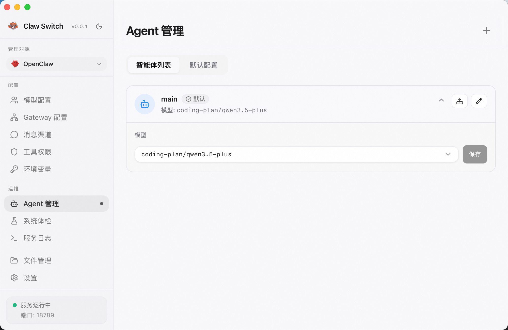 | 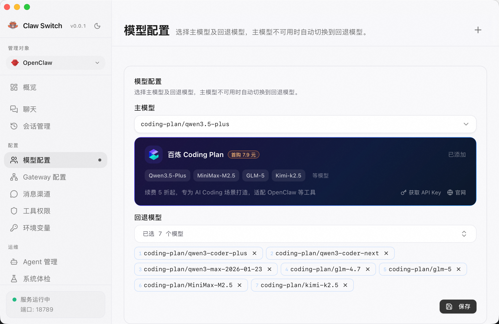 |

| 诊断 | 日志 |
| :---------------------------------------: | :------------------------------------------: |
| 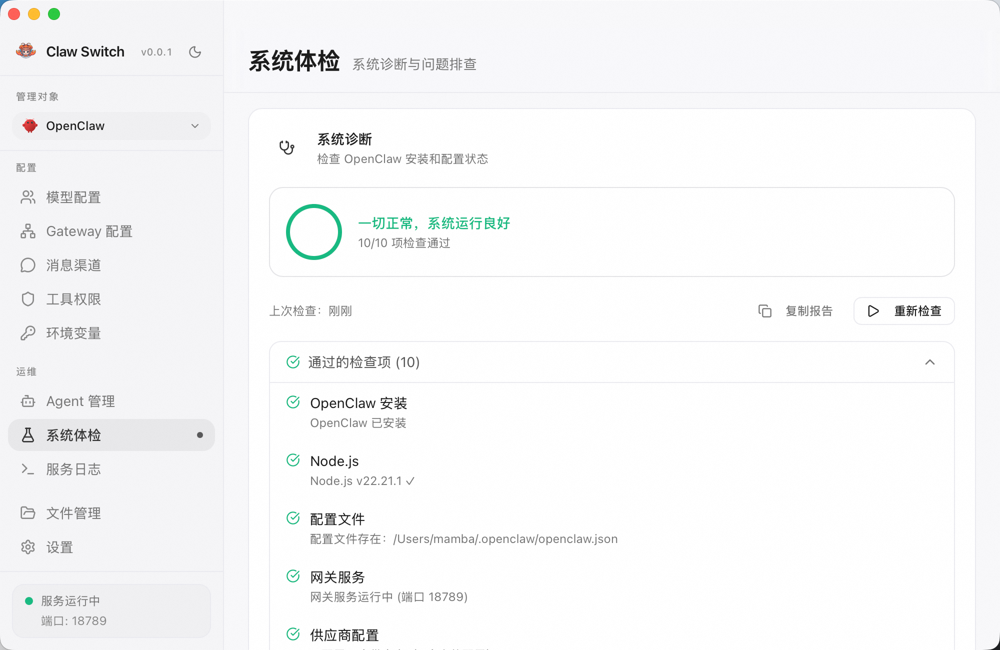 | 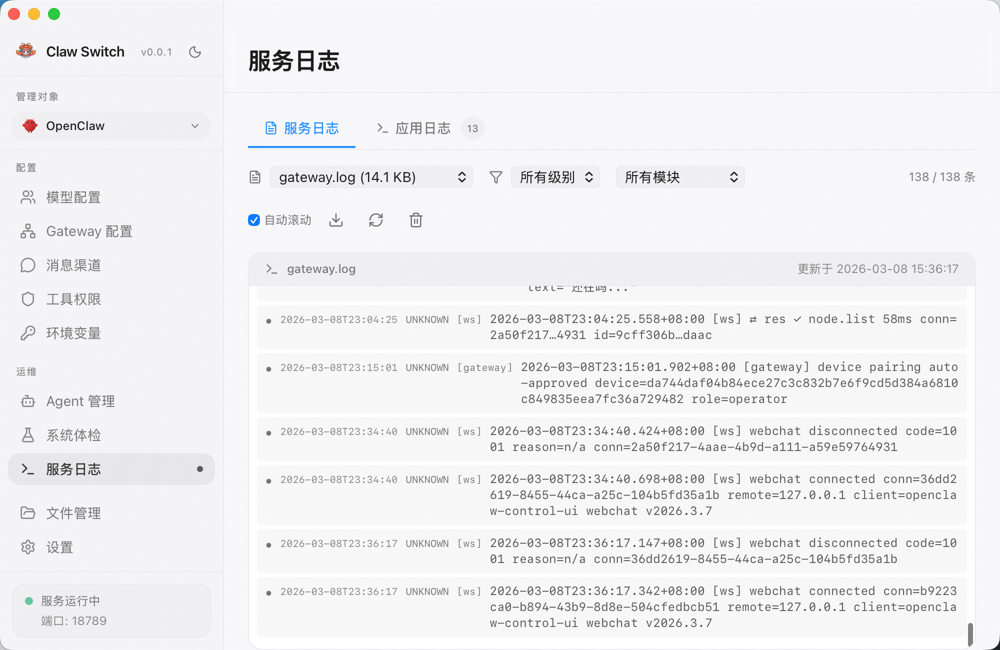 |

---

## 功能特性摘要

- **供应商管理**：50+ 预设、系统托盘快速切换、拖拽排序。
- **OpenClaw 专属**：渠道配置、Agent 默认值、诊断与自动修复、按模块/级别过滤的日志。
- **多工具**：Claude Code / Codex / Gemini CLI / OpenCode / OpenClaw 的供应商、MCP、Prompts 统一管理。

---

## 常见问题

<details>
<summary><strong>支持哪些 AI 编程工具？</strong></summary>

支持 Claude Code、Qwen Code、OpenCode、OpenClaw 等，每个都有专属供应商预设与配置管理。
</details>

<details>
<summary><strong>什么是 Coding Plan？</strong></summary>

阿里云百炼的 AI 编程服务，提供 Qwen、GLM、MiniMax、Kimi 等模型的统一接入。Claw Switch 内置预设，支持国内/国际区域，首购低至 7.9 元。
</details>

<details>
<summary><strong>OpenClaw 渠道如何配置？</strong></summary>

OpenClaw 面板 → 渠道配置，选择飞书/钉钉等，按提示填凭证。部分渠道需先安装插件，界面会提示。
</details>

<details>
<summary><strong>数据存在哪？</strong></summary>

数据库 `~/.claw-switch/claw-switch.db`，设置 `~/.claw-switch/settings.json`，备份与 Skills 在 `~/.claw-switch/backups/` 与 `~/.claw-switch/skills/`。
</details>

<details>
<summary><strong>首次打开提示「无法验证开发者」？</strong></summary>

从 Releases 下载的安装包未经 Apple 公证时，macOS 会拦截。可任选一种方式：

**方式一（推荐）**：前往 **系统设置 → 隐私与安全性**，在「安全性」中找到被拦截的应用，点击 **「仍要打开」**，再在弹窗中确认即可。

| 系统设置入口 | 点击「仍要打开」 |
| :----------: | :--------------: |
| 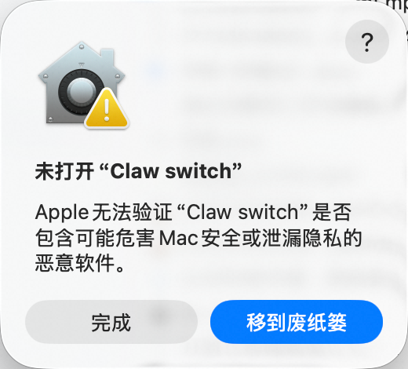 | 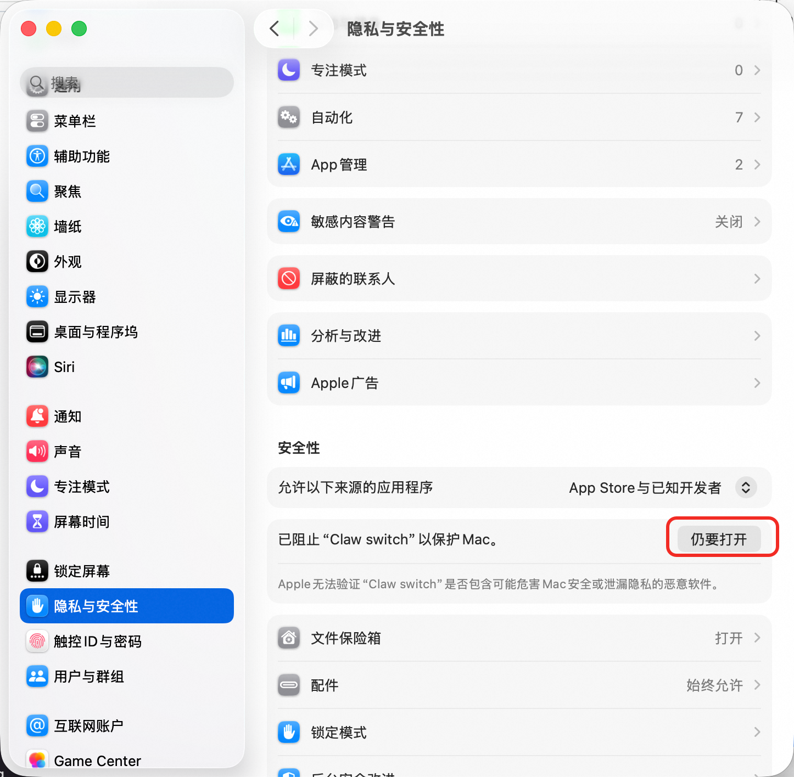 |

**方式二**：在终端执行（将路径换成你实际的 .app 位置，如在「应用程序」里则为 `/Applications/Claw Switch.app`）：

```bash
sudo xattr -rd com.apple.quarantine /Applications/Claw\ Switch.app
```

执行后输入密码，再双击打开应用即可。
</details>

---

## 贡献与许可

欢迎提交 Issue 和 PR。提交前请跑通 `pnpm typecheck` 与 `pnpm test:unit`。

License: MIT
